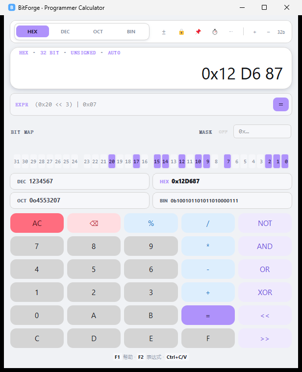
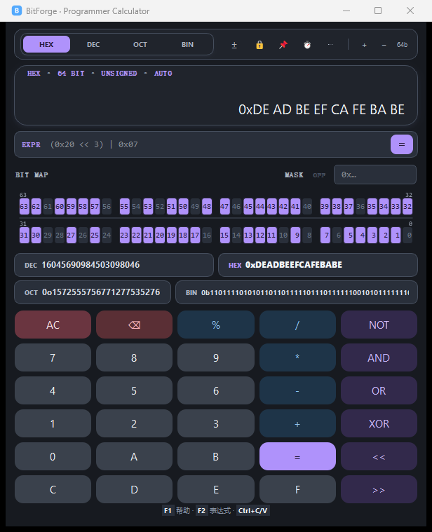
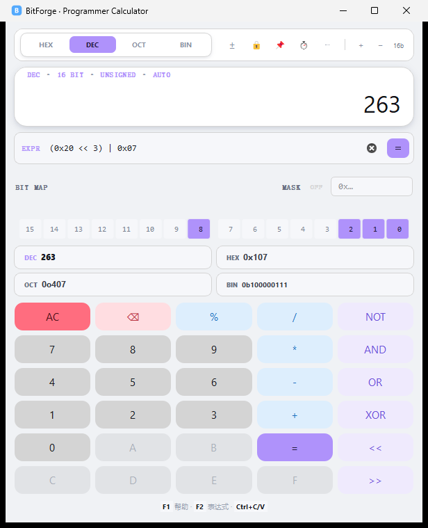

# BitForge

<p align="center">
  <code style="font-size:48px;font-weight:bold;color:#53A9FD">🔧 BitForge</code>
</p>
<p align="center">
  <b>BitForge</b> — A programmer calculator for embedded engineers.<br>
  一款面向嵌入式工程师的程序员计算器，基于 PyQt5 + SiliconUI。
</p>

<p align="center">
  <a href="#features">Features</a> ·
  <a href="#quick-start">Quick Start</a> ·
  <a href="#keyboard">Shortcuts</a> ·
  <a href="#build">Build</a> ·
  <a href="#license">License</a>
</p>

---

## Features / 功能

| Feature | Description |
|---------|-------------|
| 🧮 **Arithmetic** | `+` `−` `×` `/` `%` with integer division |
| 🔢 **Radix Switch** | HEX / DEC / OCT / BIN — input in any base |
| 📐 **Auto Bit-Width** | 8/16/32/64 bit auto-range with manual lock, presets and step buttons |
| 🔟 **Multi-Radix Display** | All 4 bases shown simultaneously (2×2 layout) |
| 🧰 **Bit Tools** | Rotate, byte swap, bit-field extract/write, and sign extension from the Tools menu |
| 🧠 **Expression Mode** | Parentheses, radix prefixes, and safe 64-bit arithmetic without `eval` |
| 💡 **Bit Indicator** | Bit-level visualization with numbered positions |
| 🖱️ **Bit Click Toggle** | Click any bit to flip 0↔1 (right-click to clear, hover to inspect) |
| 📋 **One-Click Copy** | `Ctrl+C` copies display; click a DEC/HEX/OCT/BIN row to copy that radix; right-click display for a copy menu |
| 🧩 **Visible Bit Cells** | Every bit renders as a cell — click targets are always visible |
| 🔎 **Grouped Long Values** | HEX groups by byte and BIN groups by nibble; copy always keeps the raw value |
| ✏️ **Pending Expression** | Current operand/operator shown in the display corner |
| 📌 **Always on Top** | Pin the window above other apps |
| 💾 **Settings Memory** | Radix, sign mode, bit-width lock and window position are restored on restart |
| ⌨️ **Smart Ops** | Pressing a second operator replaces it; repeated `=` repeats the last operation |
| 📥 **Paste** | `Ctrl+V` auto-detects `0x` / `0b` / `0o` / `xxh` / decimal values |
| ⚙️ **Bit-Width Presets** | Click the bit-width label to lock directly to 8 / 16 / 32 / 64 bit |
| 🕘 **History** | Last 10 results in a toolbar dropdown — click to reload |
| ↔️ **64-bit Dual Row** | 64-bit splits into two 32-bit rows (63–32 / 31–0) |
| ± **Signed/Unsigned** | Toggle signed interpretation of DEC values |
| 🎨 **Themes** | Switch between clean light and focused dark themes; the choice is remembered |
| ⌨️ **Full Keyboard** | All operations accessible via keyboard |
| ⚡ **Fast Rendering** | QPixmap cache eliminates mouse-over lag |
| 🚀 **Quick Startup** | Delayed imports + immediate icon release |

---

## Screenshots / 截图

**Light / 亮色主题**



**Dark · 64-bit / 暗色主题 · 64 位双行**



**Expression Mode / 表达式模式**



---

## Quick Start / 快速开始

### Run from source (no install required)

```bash
python bitforge.py
```

Or double-click `run.bat` on Windows.

### Pre-built EXE

Download the latest release from [Releases](https://github.com/Hush-xv/BitForge/releases) — **no Python required**.

### Requirements

- Python 3.8+
- PyQt5 ≥ 5.15
- SiliconUI ≥ 1.0 (from [PyQt-SiliconUI](https://github.com/ChinaIceF/PyQt-SiliconUI))

```bash
pip install PyQt5 numpy typing_extensions
git clone https://github.com/ChinaIceF/PyQt-SiliconUI.git
cd PyQt-SiliconUI && python setup.py install
```

---

## Keyboard Shortcuts / 键盘快捷键

| Key | Action |
|-----|--------|
| `0`–`9` | Digit input |
| `A`–`F` | Hex digits (HEX mode only) |
| `+` `-` `*` `/` `%` | Arithmetic operators |
| `&` `\|` `^` `~` | Bitwise AND / OR / XOR / NOT |
| `<` `>` | Left shift / Right shift |
| `Enter` / `=` | Evaluate |
| `Backspace` | Delete last digit |
| `Esc` / `Delete` | Clear all (AC) |
| `Ctrl+C` | Copy current display value |
| `Ctrl+V` | Paste value (`0x`/`0b`/`0o`/`xxh`/decimal auto-detected) |
| `F1` | Open the quick help dialog |
| `F2` | Focus the expression input |

---

## Build / 打包

```bash
pip install pyinstaller

# Directory mode (fast startup) — output: dist/BitForge/
python build.py

# Single-file mode (portable) — output: dist/BitForge.exe
python build.py --portable
```

---

## Project Structure / 项目结构

```
BitForge/
├── bitforge.py       # Main application (~1450 lines)
├── build.py          # PyInstaller packaging script
├── test_bitforge.py  # Test suite (187 checks) — run before every release
├── bitforge.ico      # Application icon (256×256)
├── run.bat           # Quick-launch script
├── README.md
└── dist/
    └── BitForge/     # Standalone distribution
        └── BitForge.exe
```

---

## Tech Stack / 技术栈

| Layer | Technology |
|-------|-----------|
| **UI Framework** | [PyQt5](https://pypi.org/project/PyQt5/) |
| **Widget Library** | [PyQt-SiliconUI](https://github.com/ChinaIceF/PyQt-SiliconUI) |
| **Packaging** | PyInstaller (onedir / onefile) |
| **Theme** | Light & dark themes, ~60 color tokens, choice remembered via QSettings |

---

## License / 许可证

BitForge is licensed under the **GPLv3** License, inherited from PyQt-SiliconUI.

```
Copyright (C) 2025 Hush-xv

This program is free software: you can redistribute it and/or modify
it under the terms of the GNU General Public License as published by
the Free Software Foundation, either version 3 of the License.
```

---

## Acknowledgments / 致谢

- [ChinaIceF/PyQt-SiliconUI](https://github.com/ChinaIceF/PyQt-SiliconUI) — The elegant PyQt5 UI framework
- Built via [vibe coding](https://github.com/Hush-xv/BitForge) — conversational AI-assisted development
